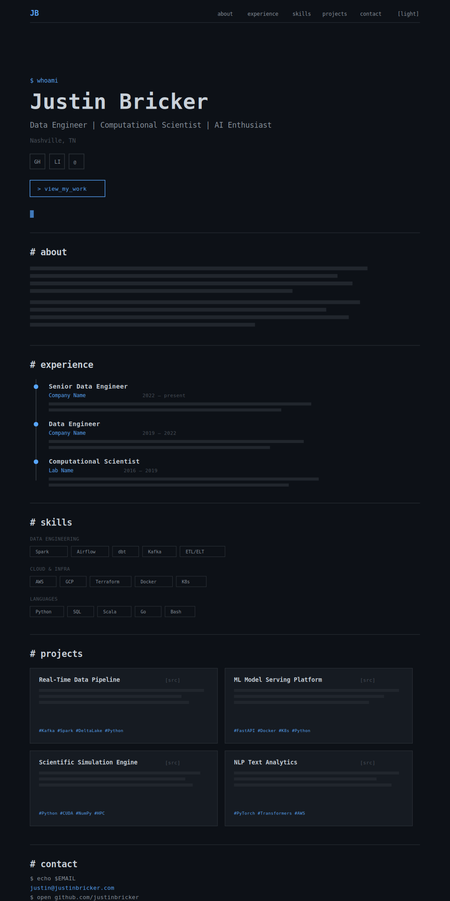
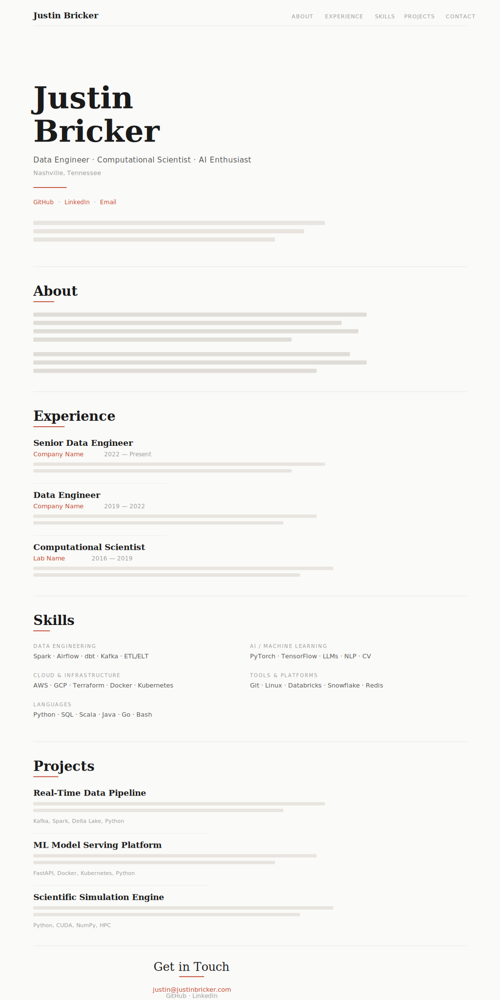
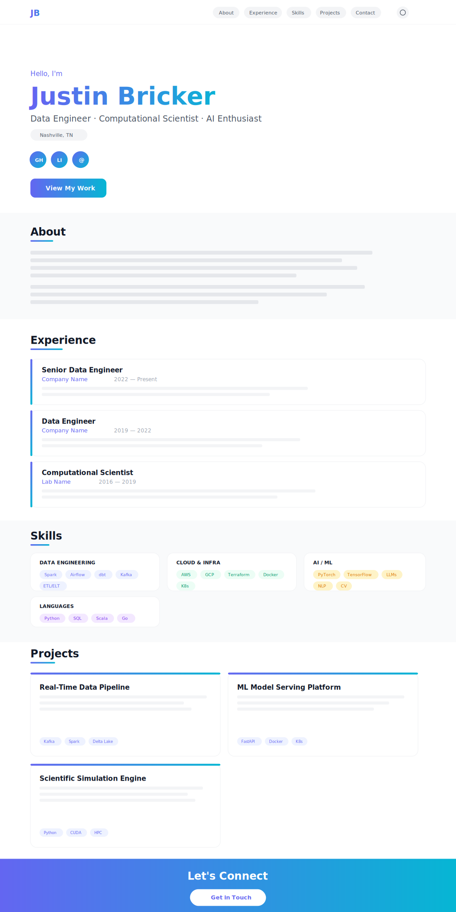

# Design Mockups

Three design directions for justinbricker.com. Each mockup includes an SVG preview (viewable in GitHub) and a DESIGN.md with detailed specifications.

---

## [Slate](./slate/)

**Terminal-inspired, developer-centric.** Dark background, monospace typography, sharp edges, single accent color. The vibe is "someone who lives in the terminal built their portfolio."

[View design details →](./slate/DESIGN.md)

---

## [Meridian](./meridian/)

**Editorial, refined, light-first.** Serif headings, clean sans-serif body, generous whitespace, warm terracotta accent. The vibe is "thoughtful scientist who values clarity and craft."

[View design details →](./meridian/DESIGN.md)

---

## [Signal](./signal/)

**Bold, modern, energetic.** Indigo-to-cyan gradient accent, chunky rounded cards, strong visual hierarchy, colorful skill pills. The vibe is "forward-thinking engineer who builds the future."

[View design details →](./signal/DESIGN.md)
